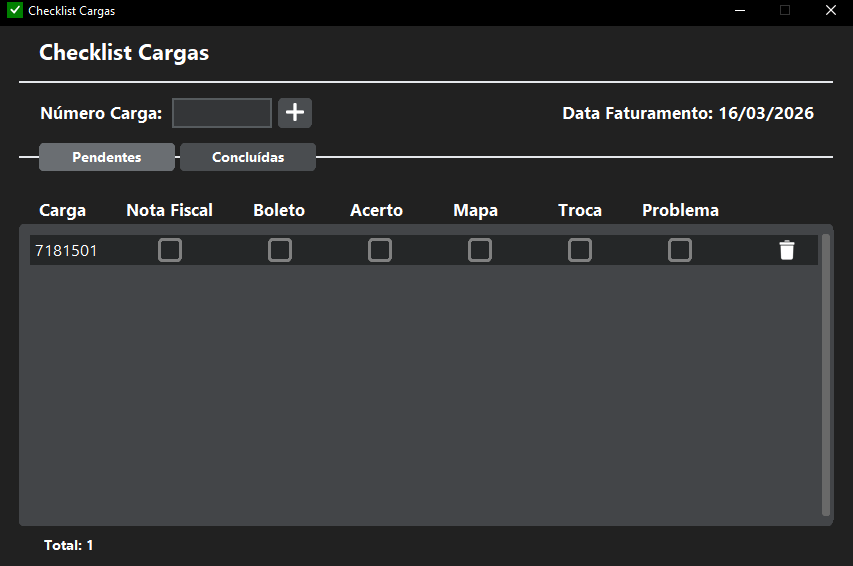
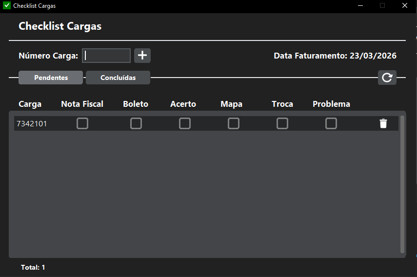
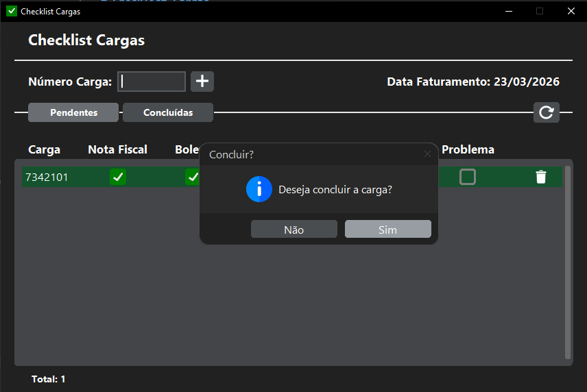
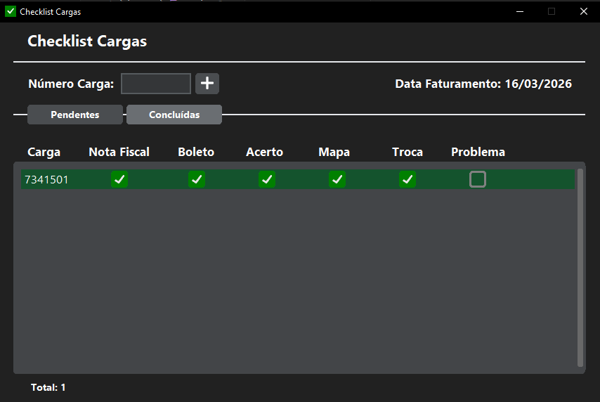
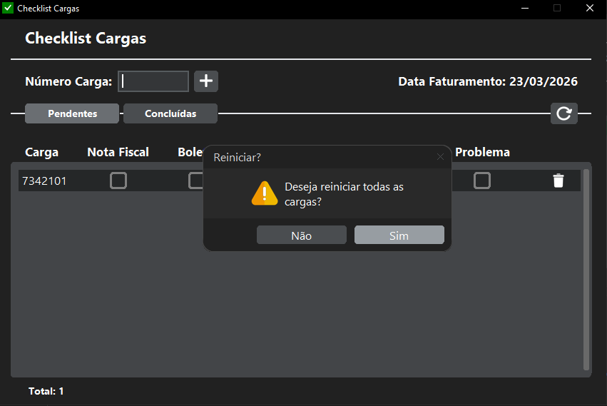

# Checklist Cargas

Aplicativo desktop para melhorar o gerenciamento do trabalho e da comunicação entre equipes, desenvolvido em Python com interface gráfica feita em CustomTkinter.

## Preview






## Funcionalidades

- Criar checklist de carga.
- Marcar itens concluídos.
- Reiniciar todas as cargas.
- Atualização automática entre máquinas.
- Interface moderna com CustomTkinter.
- Integração com banco de dados SQLite.

## Tecnologias Utilizadas
**Python 3.13.1** <br>
**CustomTkinter 5.2.2** <br>
**SQLite3 2.6.0** <br>
**Arquitetura MVC**

## Estrutura do Projeto
```
project/
│
├── assets/
│   ├── icons/
│   ├── images/
├── constants/
├── controllers/
├── database/
├── models/
├── services/
├── validators/
├── views/
│   ├── checklist/
|   │     ├── components/
│   └── dialogs/
│
├── .gitignore
├── DOCS_DBMONITOR.md
├── README.md
│
└── main.py
```

## Instalação

**Clone o repositório:**
```
git clone git@github.com:LUC4SMELLO/Checklist_Cargas.git
```
**Entre na pasta:**
```
cd Checklist_Cargas
```
**Instale as dependências:**
```
pip install -r requirements.txt
```
**Execute:**
```
python main.py
```

## Como Usar
1. Abra o aplicativo.
2. Crie um checklist.
3. Marque os itens conforme forem concluídos.
4. O sistema atualizará automaticamente as mudanças no banco de dados.

## Arquitetura
O projeto segue o padrão **MVC (Model-View-Controller)**:

- **Model** → acesso ao banco de dados.
- **View** → interface gráfica com CustomTkinter.
- **Controller** → lógica da aplicação.

## Melhorias Futuras
- Sistema de login.
- Histórico de checklists.
- Exportação de relatórios.
- Interface mais personalizável.

## Autoria
- Lucas Pereira Silva Mello
